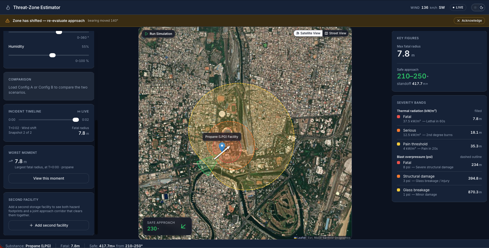
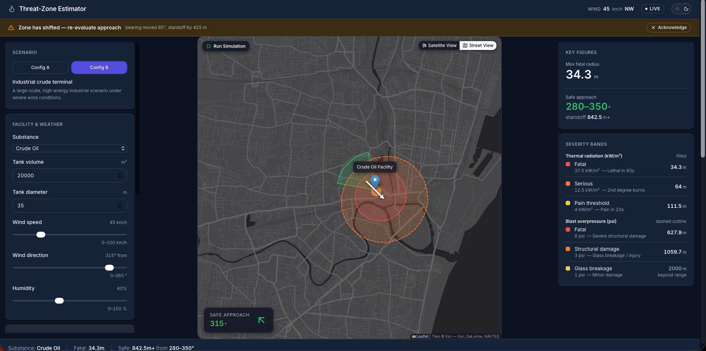
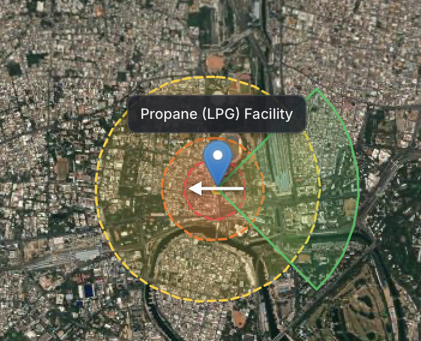
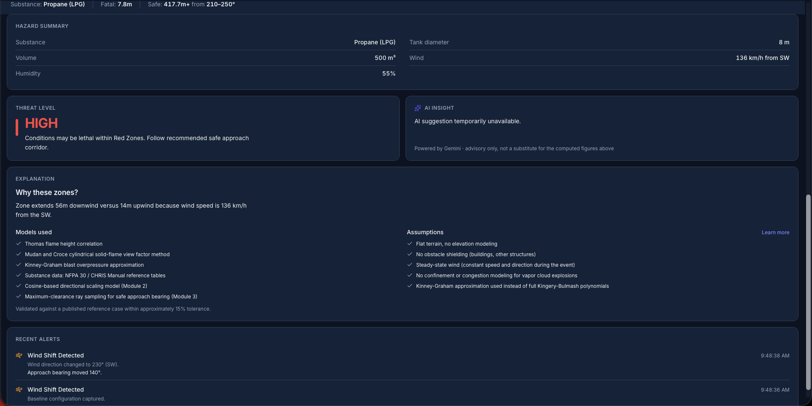

# DER-02: Threat-Zone Estimation

**A physics-based decision-support tool for industrial fire and explosion response — built in 24 hours for Hacktronics 2nd Edition, VIT Chennai.**

> When a storage tank catches fire, the difference between a safe approach and a fatal one is often a single number a responder never had time to calculate.

---

## The Problem This Solves

On 29 October 2009, a fire broke out at the Indian Oil Corporation depot in Sitapura, Jaipur. It killed 12 people, injured over 300, and forced the evacuation of half a million residents. It burned, uncontrolled, for more than a week. Investigators later found the depot — storing 24 million litres of diesel and 7 million litres of petrol across 11 tanks — had no computerized fire-risk model and no real-time hazard-distance guidance for the responders standing at its perimeter.

Twenty-five years earlier, on 19 November 1984, a series of boiling-liquid-expanding-vapour explosions (BLEVEs) at a PEMEX LPG storage terminal in San Juan Ixhuatepec, Mexico, killed over 500 people and injured thousands more — one of the deadliest industrial disasters in history. A subsequent inquiry cited inadequate spacing between storage vessels and a lack of any real-time hazard modeling among the contributing factors. A fire chief had called the facility "a time bomb" two years before it exploded — but there was no tool to tell anyone, in the moment, how far that bomb's radius actually reached.

These are not edge cases. They are the recurring, well-documented failure mode this project targets: **a fire commander arriving at a tank fire today has two options — rough judgement ("stay back, keep your distance"), or expensive, specialist consequence-modeling software (like ALOHA or PHAST) that most fire departments cannot access or run on the spot.** A wrong guess about the danger radius does not produce a bad outcome on a spreadsheet. It puts a person in a lethal zone.

**DER-02 exists to close that specific gap**: a free, fast, physics-grounded tool that computes a real hazard footprint — not a guess, not a fixed-radius circle — in real time, and tells a responder exactly where it is safe to stand.

---

## What Makes This Different From "Just Drawing a Circle"



*The live dashboard — a propane depot under 136 km/h wind from the south-west. The hazard footprint is visibly stretched downwind, and the green wedge marks the recommended approach corridor.*

The problem statement this project was built for explicitly disqualifies the most common shortcut: a fixed-radius circle around a tank. Real hazards don't spread evenly — heat and blast pressure are carried further downwind by moving air and travel less far upwind, against it. A circle is not just imprecise here; it's actively misleading, and in a domain where being misled can kill someone, that's not an acceptable trade-off.

| What most tools do | What DER-02 does |
|---|---|
| A fixed-radius circle, or no visualization at all | A wind-warped, asymmetric hazard footprint — genuinely computed at 72 independent angles, not fitted to look right |
| Leaves the "where do I stand" decision to a human reading a map | Automatically computes and highlights the single safest approach bearing, with a guaranteed-safe standoff distance |
| A black-box output with no visible reasoning | A live explainability panel that generates its own plain-language reasoning from the exact numbers driving the map |
| Expensive specialist software (ALOHA, PHAST) | Free, browser-based, real-time, with no license required |

---

## How It Works

```
Facility & weather inputs
        │
        ▼
Physics Engine — symmetric, no-wind hazard radii
per severity band, for thermal radiation and blast overpressure
        │
        ▼
Wind-Adaptive Geometry — warps those radii into a
directional polygon: stretched downwind, compressed upwind
        │
        ▼
Graded Severity Visualization + Safe Approach — renders
the polygon on a real map, computes the safest approach bearing
        │
        ▼
Live Incident Dashboard — assembles map, controls,
key figures, and alerts into one coherent screen
        │
        ▼
Explainability Layer — generates a live, plain-language
explanation of the exact numbers currently on screen
```

No layer in this pipeline recomputes a calculation an earlier layer already performed. This isn't just clean architecture — it's what makes the whole system auditable: every number on screen can be traced back to exactly one place it was computed.

### The Physics

- **Thermal radiation** — a solid flame model: flame height via the Thomas correlation, flame tilt from wind, a full Mudan-Croce cylindrical view-factor calculation (how much of the flame a person at a given distance can actually "see"), and atmospheric transmissivity computed from a real water-vapour absorption correlation — so humidity genuinely changes the hazard radius, not just the number on a slider.
- **Blast overpressure** — TNT-equivalent mass conversion, Hopkinson-Cranz cube-root scaling, and the Kinney-Graham closed-form approximation — a deliberate, disclosed trade-off against the more complex Kingery-Bulmash polynomials, chosen to reduce implementation risk without sacrificing physical validity.
- **Five real substances** modeled with sourced properties: propane (LPG), gasoline, LNG, crude oil, and ethylene.
- Every threshold used (37.5 kW/m² fatal, 12.5 kW/m² serious injury, 8 psi structural collapse, and so on) is a standard, cited value from published fire and blast consequence-modeling literature — not an invented round number.

### The geometry

Rather than fitting an ellipse to "look" wind-blown, the system independently computes the hazard radius at 72 angles around the source and scales each one using a cosine-based directional weighting function — maximum stretch exactly downwind, maximum compression exactly upwind, smooth and glitch-free at every compass bearing including the 0°/360° wraparound. Zero wind produces a mathematically perfect circle, with no special-case code required.



*Config B — a 20,000 m³ crude oil terminal under 45 km/h wind from the north-west, with a 34.3 m fatal radius and a safe approach of 280–350°. Every band is recomputed from the substance's own properties, not scaled from a template.*

### The safe-approach recommendation

The single feature that most directly answers the problem statement's own stated goal ("so that a safe approach direction can be chosen"): the system reuses the same 72 per-angle hazard distances to find the bearing with maximum clearance from the outer hazard boundary, adds a safety margin, and reports a full range of safe bearings — not a single knife-edge line, and never simply "the direction opposite the wind," since that shortcut fails the moment a second nearby facility changes the true safest direction.



*The approach corridor sits entirely outside the outermost hazard band — a geometric guarantee, not a visual estimate.*

### Multi-facility escalation risk

DER-02 also models a second, independently configured facility and checks whether either one's hazard zone reaches the other's location — a real, documented industrial phenomenon called a domino effect, where one incident triggers a second. When both facilities' zones are active, the safe-approach recommendation is computed jointly, guaranteed by a hard geometric check to sit outside *both* hazard footprints — never in the gap between them, which a naive combination of the two zones can otherwise recommend.

---

## Live Explainability, Not Just a Pretty Map

Every zone rendered on screen is paired with a plain-language explanation, generated live from the exact numbers driving that zone — never a pre-written, generic description. Open the panel below the map during a live scenario and it will tell you, correctly, why *this* zone looks the way it does: "Zone extends 340m downwind versus 90m upwind because wind speed is 25 km/h from the northwest." Change the wind, and the sentence changes with it. This is a demonstration of the model's reasoning, not a claim about it.



*The panels below the map: hazard summary, computed threat level, the live-generated explanation with its cited models and stated assumptions, and a timestamped log of every detected change.*

The system also discloses its own limitations proactively: flat terrain, no obstacle shielding, steady-state wind, no confinement modeling for vapor cloud explosions. These are stated as deliberate, reasoned engineering trade-offs appropriate to a 24-hour build — not hidden shortcuts.

---

## Tech Stack

| Layer | Technology |
|---|---|
| Backend / physics | Python, FastAPI |
| Frontend | React (Vite), Tailwind CSS, Zustand |
| Mapping | Leaflet.js, Esri World Imagery (satellite tiles) |
| Database | MySQL |
| AI insight layer | Google Gemini API (server-proxied — key never exposed client-side) |
| Testing | pytest (backend), full hardening/edge-case test suite |

---

## Getting Started

### Backend

```bash
cd backend
python -m venv venv
source venv/bin/activate  # or venv\Scripts\activate on Windows
pip install -r requirements.txt
cp .env.example .env      # fill in your local MySQL credentials and Gemini API key
uvicorn main:app --reload --port 8000
```

### Frontend

```bash
cd frontend
npm install
npm run dev
```

Visit `http://localhost:5173`.

### Running tests

```bash
cd backend
pytest
```

---

## What's Actually Built vs. What's Disclosed as a Limitation

We think a project is more credible for stating clearly what it does *not* do, rather than letting a judge discover it. This tool assumes flat terrain, does not model obstacle shielding from buildings, treats wind as steady during a single computation, and does not simulate confinement effects in a congested industrial area. Every one of these is a deliberate scope decision appropriate to the time available — documented in-app, in the same explainability panel that generates the rest of its reasoning.

---

## Team

Built for Hacktronics 2nd Edition, VIT Chennai — Domain 05: Disaster & Emergency Response.

## Sources & Further Reading

- Mudan, K.S. & Croce, P.A. — cylindrical solid-flame view factor method
- Thomas, P.H. — flame height correlation
- Kinney, G.F. & Graham, K.J. — blast overpressure approximation
- 2009 Jaipur oil depot fire — Government of India Ministry of Petroleum & Natural Gas parliamentary statement
- San Juanico disaster, 1984 — IChemE Lessons Learned Database, Incident Summary Report
